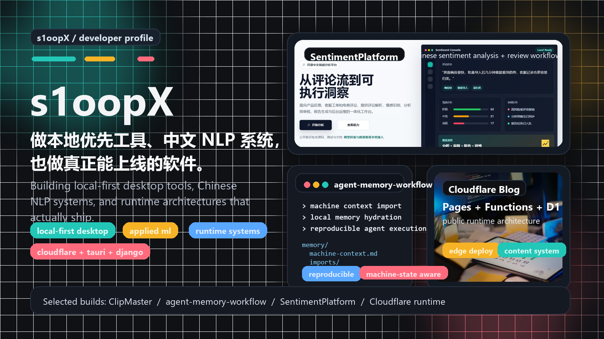
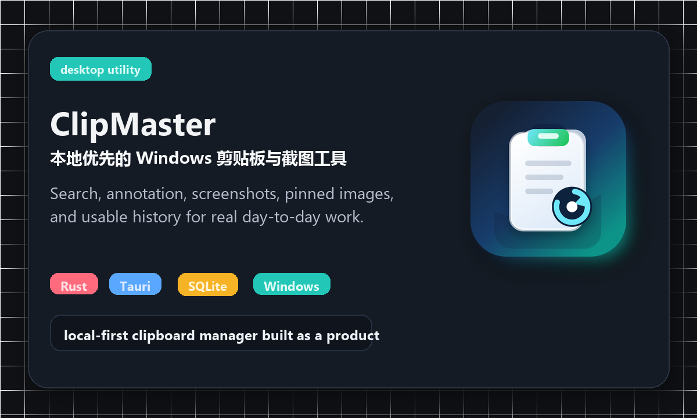
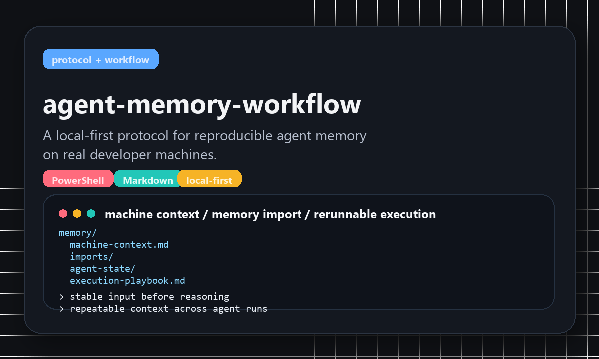
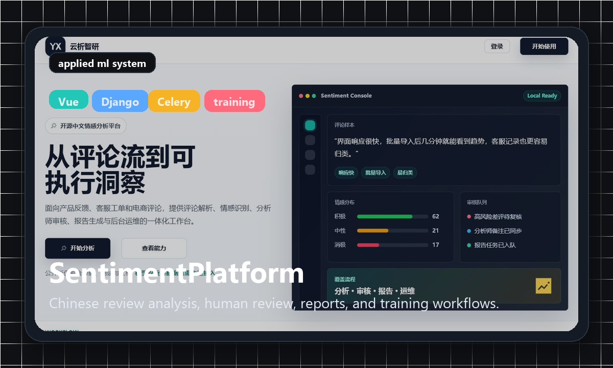
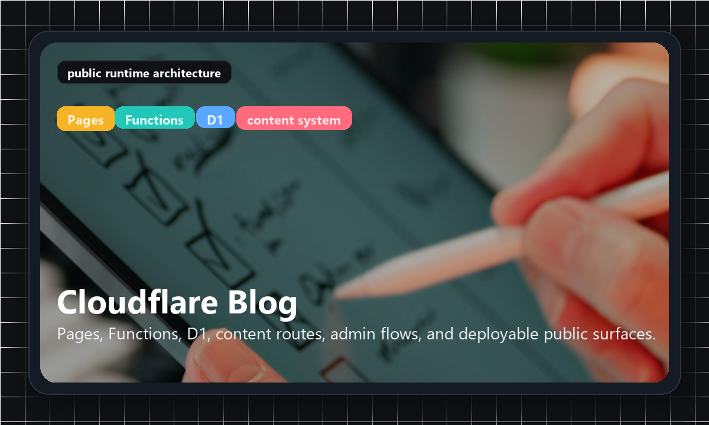

  

  <strong>不是在堆 demo，而是在做能落地的系统。</strong> 
  Local-first desktop tools, Chinese NLP systems, and runtime architecture that actually ships.

  <a href="https://github.com/s1oopX/clipmaster-tauri">ClipMaster</a>
  ·
  <a href="https://github.com/s1oopX/agent-memory-workflow">agent-memory-workflow</a>
  ·
  <a href="https://github.com/s1oopX/SentimentPlatform-Open">SentimentPlatform</a>
  ·
  <a href="https://github.com/s1oopX/s1oop-cloudflare-blog-public">Cloudflare Blog</a>

## Selected Builds

<table>
  <tr>
    <td width="50%" valign="top">
      
    </td>
    <td width="50%" valign="top">
      
    </td>
  </tr>
  <tr>
    <td width="50%" valign="top">
      
    </td>
    <td width="50%" valign="top">
      
    </td>
  </tr>
</table>

## What I Build

<table>
  <tr>
    <td width="33%" valign="top">
      <strong>Local-first tools</strong>
       
      Windows desktop software, durable local workflows, and utilities that remain useful without a network.
    </td>
    <td width="33%" valign="top">
      <strong>Applied ML systems</strong>
       
      Chinese review analysis, human-in-the-loop workflows, async jobs, and training-capable product surfaces.
    </td>
    <td width="33%" valign="top">
      <strong>Runtime architecture</strong>
       
      Public systems built with Cloudflare Pages, Functions, D1, and practical deployment constraints in mind.
    </td>
  </tr>
</table>

## Operating Taste

- `local-first` over cloud dependence
- `reproducible workflow` over fragile setup
- `product surface` over portfolio mockup
- `shipping` over endless concepting

## Elsewhere

- Blog: <a href="https://s1oop.bbroot.com">s1oop.bbroot.com</a>
- Base: Hong Kong, China
- Stack: `Rust` `Tauri` `Python` `Django` `Vue` `JavaScript` `Cloudflare` `SQLite` `PowerShell`
