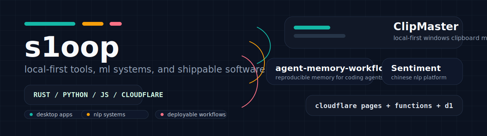

  

  <strong>做本地优先工具、开发者工作流和可落地的软件系统。</strong> 
  Building local-first tools, developer workflows, and software that actually ships.

<table>
  <tr>
    <td width="34%" valign="top">
      <strong>Now Building</strong>
       
      Windows desktop apps with Rust and Tauri.
        
      Local-first protocols and agent workflows that survive real machine state.
    </td>
    <td width="33%" valign="top">
      <strong>Core Stack</strong>
       
      <code>Rust</code> <code>Python</code> <code>JavaScript</code>
       
      <code>Tauri</code> <code>Django</code> <code>Vue</code> <code>Cloudflare</code>
    </td>
    <td width="33%" valign="top">
      <strong>Elsewhere</strong>
       
      <a href="https://s1oop.bbroot.com">Blog</a>
       
      Hong Kong, China
       
      shipping practical systems, not mock projects
    </td>
  </tr>
</table>

  <a href="https://github.com/s1oopX/clipmaster-tauri">ClipMaster</a>
  ·
  <a href="https://github.com/s1oopX/agent-memory-workflow">agent-memory-workflow</a>
  ·
  <a href="https://github.com/s1oopX/SentimentPlatform-Open">SentimentPlatform-Open</a>
  ·
  <a href="https://github.com/s1oopX/s1oop-cloudflare-blog-public">Cloudflare Blog</a>

## Featured Systems

<table>
  <tr>
    <td width="50%" valign="top">
      <h3><a href="https://github.com/s1oopX/clipmaster-tauri">ClipMaster</a></h3>
      
Local-first clipboard and screenshot manager for Windows, built as a real desktop product instead of a demo shell.

      
<em>Focus:</em> search, annotation, screenshots, image pinning, and usable history.

      
<code>Rust</code> <code>Tauri</code> <code>SQLite</code>

    </td>
    <td width="50%" valign="top">
      <h3><a href="https://github.com/s1oopX/agent-memory-workflow">agent-memory-workflow</a></h3>
      
A protocol and workflow for reproducible agent memory on real developer machines.

      
<em>Focus:</em> memory import, machine context, and repeatable agent execution.

      
<code>PowerShell</code> <code>Markdown</code> <code>local-first</code>

    </td>
  </tr>
  <tr>
    <td width="50%" valign="top">
      <h3><a href="https://github.com/s1oopX/SentimentPlatform-Open">SentimentPlatform-Open</a></h3>
      
A Chinese sentiment analysis platform covering web UI, APIs, async tasks, and training workflows.

      
<em>Focus:</em> applied NLP with operational workflows instead of notebook-only demos.

      
<code>Python</code> <code>Django</code> <code>Vue</code> <code>Celery</code>

    </td>
    <td width="50%" valign="top">
      <h3><a href="https://github.com/s1oopX/s1oop-cloudflare-blog-public">s1oop-cloudflare-blog-public</a></h3>
      
Public source for a Cloudflare-based blog architecture using Pages, Functions, and D1.

      
<em>Focus:</em> edge deployment, data-backed runtime, and public-facing architecture.

      
<code>JavaScript</code> <code>Cloudflare</code> <code>D1</code>

    </td>
  </tr>
</table>

## What I Optimize For

<table>
  <tr>
    <td width="33%" valign="top">
      <strong>Local-first by default</strong>
       
      Tools that stay useful even when the network disappears.
    </td>
    <td width="33%" valign="top">
      <strong>Reproducible workflows</strong>
       
      Systems that can be rerun, reasoned about, and handed off cleanly.
    </td>
    <td width="33%" valign="top">
      <strong>Shippable software</strong>
       
      I like projects that can move from idea to something people can actually use.
    </td>
  </tr>
</table>

